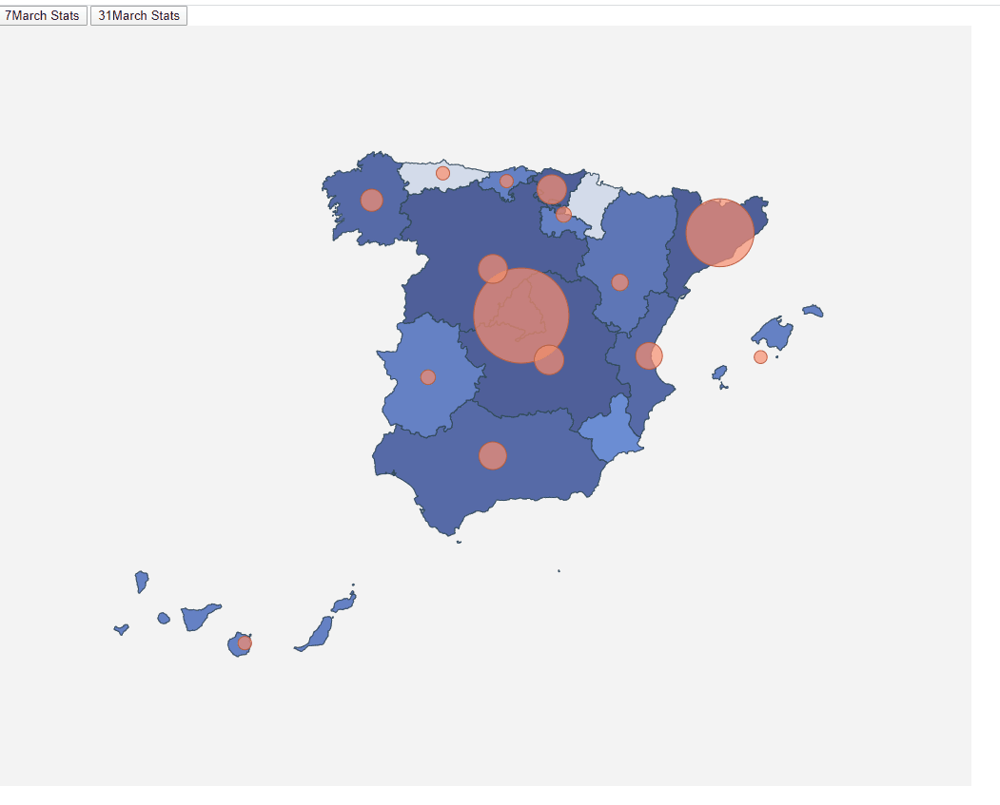

# SPAIN----------COVID-19----------

# Update Map including background color depending on affected by Coronavirus

The final project is like the following  image:




This code is based on:

- Lemoncode
https://github.com/Lemoncode/d3js-typescript-examples/tree/master/02-maps/02-pin-location-scale

- InmaculadaVF

https://github.com/InmaculadaVF/d3JS-Mandatory_tasks.git


Apart from that codes I have added background color of communities 
is based on affected number that change with the buttons and The colors 
are depend on the affected cases.


# STEPS

# Instalation

- We starting with the code:d3JS-Mandatory_tasks
- We will clone the project and execute:

```bash
npm install
```
```bash
npm start
```

# Exercise

- 1. Delete fill atribute in map.css.country to change bakground of communities.

_./src/map.css_

```typescript
.country {
  stroke-width: 1;
  stroke: #2f4858;
}
```

- 2. Define the color gradient.

_./src/index.ts_

```typescript
var color = d3
  .scaleThreshold<number, string>()
  .domain([1, 10, 20, 50, 100, 200, 500, 1000, 2000, 3000, 6000, 90000])
  .range([
    "#d3dbeb",
    "#c2cfea",
    "#b1c3ea",
    "#9fb8e9",
    "#8eace8",
    "#83a2e1",
    "#7797da",
    "#6c8dd3",
    "#6581c4",
    "#5e76b6",
    "#566aa7",
    "#4f5f99"
    
  ]);
```

- 3. Change the color of the region depending on the number of affected cases and draw the map.

_./src/index.ts_

```typescript
const assignProvincenColor = (name: string) => {
      const item =data.find(
        item => item.name === name
        );
        return item ? color(item.value): color(0);
      };

svg
      .selectAll("path")
      .data(geojson["features"])
      .enter()
      .append("path")
      .attr("class", "country")
      .attr("fill",d => assignProvincenColor(d["properties"]["NAME_1"]))
      .attr("d", geoPath as any)
      .merge(svg.selectAll("path") as any)
      .transition()
      .duration(500)
      .attr("fill", d=> assignProvincenColor(d["properties"]["NAME_1"]));
```


