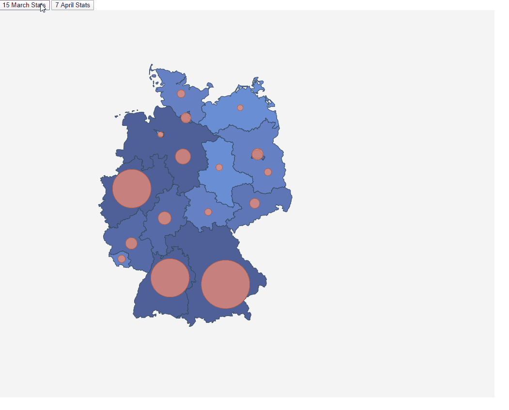

# Germany----------COVID-19----------

# Update Map including background color depending on affected by Coronavirus in Germany

The final project is like the following  image:




This code is based on:

- Lemoncode
https://github.com/Lemoncode/d3js-typescript-examples/tree/master/02-maps/02-pin-location-scale

- InmaculadaVF
https://github.com/InmaculadaVF/d3JS-Advanced-Tasks.git


# STEPS

Apart from that codes, I have chaged the map with their regions that
is based on affected number that change with the buttons and The colors 
are depend on the affected cases.

# Instalation

- We starting with the code:d3JS-Advanced-Tasks
- We will clone the project and execute:

```bash
npm install
```
```bash
npm start
```

# Exercise

- Firstly chage Spain.json by Germany.json with all regions. Topojson get from https://github.com/deldersveld/topojson/blob
/master/countries/germany/dach-states.json

_./src/Germany.json_


- Secondly change the communities informations by the new communities of the selected map(Germany):

_./src/communities.ts_

```typescript
export const latLongCommunities: DataEntry[] = [
  {
    name: "Baden-Württemberg",
    long: 9.261474,
    lat: 48.810390
  },
  {
    name: "Bayern",
    long: 11.887899,
    lat: 48.608079
  },
  {
    name: "Berlin",
    long: 13.400007,
    lat: 52.521178
  },
  {
    name: "Brandenburg",
    long: 13.893791,
    lat: 52.000325
  },
  {
    name: "Bremen",
    long: 8.810423,
    lat: 53.082599
  },
  {
    name: "Hamburg",
    long: 10.011572,
    lat: 53.553350
  },
  {
    name: "Hessen",
    long: 9.004086,
    lat: 50.639746
  },
  {
    name: "Mecklenburg-Vorpommern",
    long: 12.582399,
    lat: 53.837109
  },
  {
    name: "Niedersachsen",
    long: 9.873129,
    lat: 52.452867
  },
  {
    name: "Nordrhein-Westfalen",
    long: 7.45,
    lat: 51.51667
  },
  {
    name: "Rheinland-Pfalz",
    long: 7.430862,
    lat: 49.874849
  },
  {
    name: "Saarland",
    long: 6.968900,
    lat: 49.401140
  },
  {
    name: "Sachsen",
    long: 13.268841,
    lat: 51.079584
  },
  {
    name: "Sachsen-Anhalt",
    long: 11.586809,
    lat: 52.138665
  },
  {
    name: "Schleswig-Holstein",
    long: 9.785910,
    lat: 54.226812
  },
  {
    name: "Thüringen",
    long: 11.066720,
    lat: 50.821955
  }
];
```

- Thirdly adapt my code  for the new map in:

_./src/index.ts_

```typescript
const germanyjson = require("./Germany.json");
```

```typescript
const geojson = topojson.feature(germanyjson, germanyjson.objects.layer);
```

Adapt the next code to see the map:

```typescript
const aProjection = d3
  .geoMercator()
  .scale(2500)
  .translate([-50, 3000]);
```

- The final steps is update the number of affected case of this country(Germany).

_./src/stats.ts_

```typescript
export const InitialInfected_stats: DataEntry[] = [
  {
    name: "Baden-Württemberg",
    value: 524
  },
  {
    name: "Bayern",
    value: 804
  },
  {
    name: "Berlin",
    value: 265
  },
  {
    name: "Brandenburg",
    value: 56
  },
  {
    name: "Bremen",
    value: 53
  },
  {
    name: "Hamburg",
    value: 162
  },
  {
    name: "Hessen",
    value: 207
  },
  {
    name: "Mecklenburg-Vorpommern",
    value: 33
  },
  {
    name: "Niedersachsen",
    value: 238
  },
  {
    name: "Nordrhein-Westfalen",
    value: 1407
  },
  {
    name: "Rheinland-Pfalz",
    value: 168
  },
  {
    name: "Saarland",
    value: 32
  },
  {
    name: "Sachsen",
    value: 91
  },
  {
    name: "Sachsen-Anhalt",
    value: 40
  },
  {
    name: "Schleswig-Holstein",
    value: 79
  },
  {
    name: "Thüringen",
    value: 36
  }
];

export const FinalInfected_stats: DataEntry[] = [
  {
    name: "Baden-Württemberg",
    value: 20141
  },
  {
    name: "Bayern",
    value: 26163
  },
  {
    name: "Berlin",
    value: 3845
  },
  {
    name: "Brandenburg",
    value: 1384
  },
  {
    name: "Bremen",
    value: 399
  },
  {
    name: "Hamburg",
    value: 3059
  },
  {
    name: "Hessen",
    value: 4837
  },
  {
    name: "Mecklenburg-Vorpommern",
    value: 531
  },
  {
    name: "Niedersachsen",
    value: 6200
  },
  {
    name: "Nordrhein-Westfalen",
    value: 20220
  },
  {
    name: "Rheinland-Pfalz",
    value: 3992
  },
  {
    name: "Saarland",
    value: 1532
  },
  {
    name: "Sachsen",
    value: 2997
  },
  {
    name: "Sachsen-Anhalt",
    value: 987
  },
  {
    name: "Schleswig-Holstein",
    value: 1730
  },
  {
    name: "Thüringen",
    value: 1208
  }
];
```
